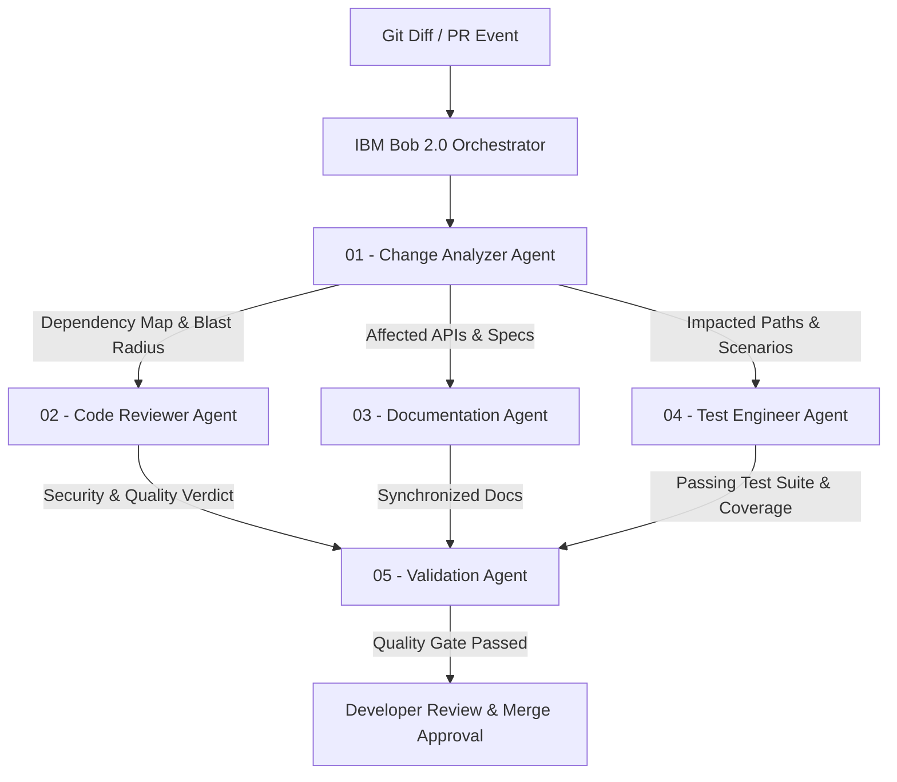

# ChangeFlow Multi-Agent Coordination Protocol (IBM Bob 2.0)

This file defines the multi-agent execution pipeline and protocol for IBM Bob 2.0 when processing software changes in this repository.

## Agent Hierarchy & Orchestration Flow

## Parallel Execution Matrix

| Agent | Trigger Condition | Parallel Group | Output Artifact |
|---|---|---|---|
| **01-change-analyzer** | Triggered immediately on diff | Sequential (Phase 1) | Impact Map JSON (`blast_radius`, `affected_apis`, `risk_level`) |
| **02-code-reviewer** | Triggered after Analyzer | Parallel (Phase 2) | Static analysis, security audit, code smell report |
| **03-documentation-agent** | Triggered after Analyzer | Parallel (Phase 2) | API & Architecture markdown diffs (`API.md`, `ARCHITECTURE.md`) |
| **04-test-engineer** | Triggered after Analyzer | Parallel (Phase 2) | Jest unit & integration test suites, coverage reports |
| **05-validation-agent** | Triggered when Phase 2 finishes | Sequential (Phase 3) | Release scorecard, Ready for Review sign-off, ROI metrics |

## Quality Gates & Thresholds
- **Code Review**: No unhandled Critical or High severity vulnerabilities.
- **Documentation**: 100% of newly added or modified endpoints must be documented.
- **Testing**: 100% test pass rate with $\ge 90\%$ line coverage on modified files.
- **Human In The Loop**: Final merge decision is always reserved for the human developer.

