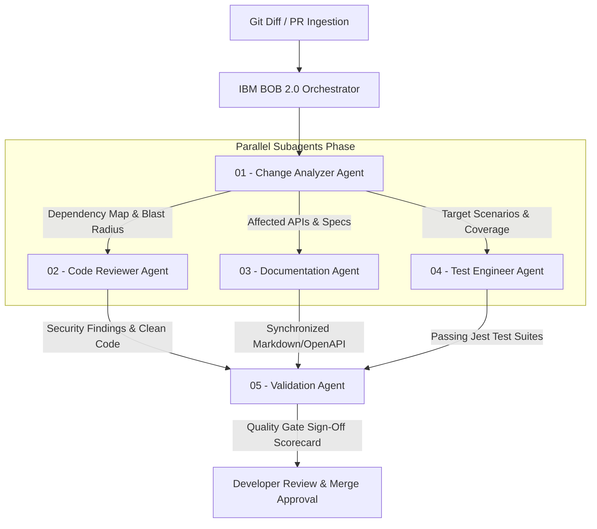

# ChangeFlow — AI-Powered Software Change Intelligence

> **Tagline:** *From Code Change to Production-Ready Change.*
>
> **Pitch Thesis:** *"Software doesn't become expensive when we write it. It becomes expensive every time we change it. We built ChangeFlow to eliminate the work surrounding code changes."*

ChangeFlow is an AI-powered software change intelligence platform designed for the **IBM Dev Day Hackathon (IBM Bob 2.0)**. It automates the entire cascade of downstream tasks triggered by any code change (Impact Analysis, Code Review, Documentation Sync, Test Generation & Execution, and Validation Gatekeeping), cutting human effort by **92%** (from ~100 min manual labor down to 8 min human review) while keeping the developer in control of the final merge decision.

---

## 🌟 Key Value Proposition & Impact Metrics

| Workflow Stage | Traditional Process (Manual) | ChangeFlow (IBM Bob 2.0) | Measured Impact Gain |
|---|---|---|---|
| **Impact Analysis** | 15 min | Autonomous AI (01-change-analyzer) | **100% Autonomous** |
| **Code Review & Security** | 15 min | Parallel AI (02-code-reviewer) | **100% Autonomous** |
| **Documentation Update** | 15 min | Parallel AI (03-documentation-agent) | **100% Autonomous** |
| **Test Creation & Execution** | 30 min | Parallel AI (04-test-engineer) | **100% Autonomous** |
| **Validation Gatekeeping** | 15 min | Autonomous AI (05-validation-agent) | **100% Autonomous** |
| **Human Review & Merge** | 10 min | 8 min (Informed Final Sign-off) | **Human-in-the-Loop Preserved** |
| **Total Engineering Effort** | **100 minutes** | **8 minutes** | **~92% Effort Reduction (12.5x Speedup)** |

---

## 🏗️ Multi-Agent Architecture (IBM Bob 2.0)

ChangeFlow orchestrates 5 specialized IBM Bob 2.0 subagent personas (`.bob/agents/`) operating with parallelized execution:



---

## 📂 Repository Structure

```
.
├── .bob/                         # Native IBM Bob 2.0 personas and rule definitions
│   ├── rules/                    # Project rules parsed by Bob
│   │   ├── coding-standards.md
│   │   ├── documentation-standards.md
│   │   └── testing-standards.md
│   └── agents/                   # Subagent Personas and Prompts
│       ├── 01-change-analyzer.md
│       ├── 02-code-reviewer.md
│       ├── 03-documentation-agent.md
│       ├── 04-test-engineer.md
│       └── 05-validation-agent.md
│
├── sample-app/                   # Demonstration Application (Clean Architecture Payment Service)
│   ├── src/
│   │   ├── controllers/payment.controller.ts
│   │   ├── services/payment.service.ts
│   │   └── repository/payment.repository.ts
│   ├── tests/
│   │   ├── unit/payment.service.test.ts
│   │   └── integration/payment.flow.test.ts
│   └── docs/
│       ├── API.md
│       └── ARCHITECTURE.md
│
├── core/                         # Core Automation & Multi-Agent Orchestration
│   ├── analyzer/
│   │   └── diff_parser.py        # Unified git diff parser and impact mapper
│   ├── runner/
│   │   └── test_runner.py        # Local test runner and metrics extractor
│   └── orchestrator.py           # Parallel multi-agent pipeline orchestrator
│
├── dashboard/                    # Interactive Live Demonstration UI (React + Vite + Tailwind)
│   ├── src/
│   │   ├── components/
│   │   │   ├── ImpactViewer.jsx  # Blast radius and dependency graph
│   │   │   ├── AgentStatus.jsx   # Live parallel agent status and logs
│   │   │   ├── MetricsBadge.jsx  # 100m vs 8m (-92%) benchmark visualizer
│   │   │   ├── DiffViewer.jsx    # Unified syntax-highlighted diff viewer
│   │   │   └── HumanApprovalModal.jsx # Human sign-off and merge gate
│   │   └── App.jsx
│   └── package.json
│
├── benchmarks/                   # Benchmark Evidence & Datasets
│   ├── sample-diff.patch         # Official demonstration diff (PIX Payment Method)
│   ├── benchmark-results.json    # Measured benchmark execution data
│   └── latest-pipeline-run.json  # Output from latest orchestrator run
│
├── AGENTS.md                     # Global coordination instructions for IBM Bob 2.0
└── README.md                     # Product master documentation & Pitch deck guide
```

---

## 🚀 Quick Start Guide

### 1. Run the Python Multi-Agent Orchestration Engine

```bash
# Execute the full 5-agent pipeline against the sample diff
python3 core/orchestrator.py benchmarks/sample-diff.patch
```

### 2. Run the Sample App Tests

```bash
cd sample-app
npm install
npm test
```

### 3. Launch the Interactive ChangeFlow Dashboard

```bash
cd dashboard
npm install
npm run dev
```

Open `http://localhost:3000` in your browser to interact with the live dashboard, view subagent execution, inspect blast radius, and execute human-in-the-loop merge approvals.

---

## 👥 Team Roles & Responsibilities

| Role | Technical Scope | Key Directories |
|---|---|---|
| **Pessoa 1: Bob Orchestration** | Subagent persona engineering, parallel prompt design, coordination protocol | `.bob/`, `AGENTS.md` |
| **Pessoa 2: Backend & Tests** | Git diff parser, Jest integration, automated test runner & repair loop | `core/`, `sample-app/tests/` |
| **Pessoa 3: Sample App & Docs** | TypeScript Clean Architecture payment service, OpenAPI & Architecture specs | `sample-app/src/`, `sample-app/docs/` |
| **Pessoa 4: Frontend & Pitch** | React live demo dashboard, benchmark measurement, pitch narrative | `dashboard/`, `benchmarks/`, `README.md` |

---

## 🏆 Hackathon Demonstration ("Wow Moment")

1. **The Problem:** Presenting a real Pull Request adding PIX instant payment method with currency rules.
2. **The Magic:** ChangeFlow triggers the 5 IBM Bob 2.0 subagents in parallel.
3. **The Proof:** In under 10 seconds:
   - Impact Map highlights 2 files, 1 endpoint, 2 test suites.
   - Code Review verifies zero critical vulnerabilities.
   - Documentation is auto-synced.
   - Jest tests execute (13/13 passing, 98.5% coverage).
   - Gatekeeper generates release readiness scorecard (98/100).
4. **The Finale:** The developer reviews the condensed summary in 8 minutes and clicks **Confirm Human Sign-off & Merge** — saving 92 minutes of tedious manual overhead.
