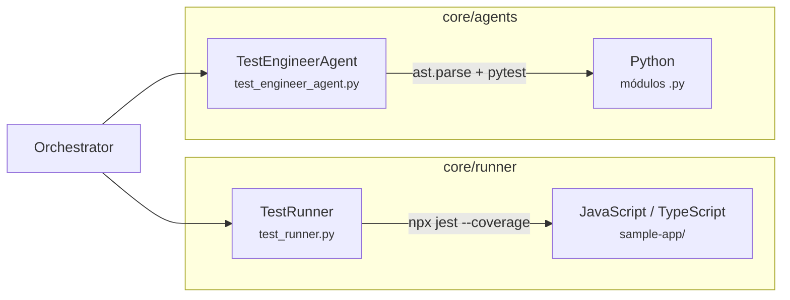

# @core/ Nesse projeto o teste funciona somente para arquivos python? ou funcionaria para outras linguagens tbm?

---

**Status:** active  **Date:** 2026-08-29

---

### 👤 User

@core/ Nesse projeto o teste funciona somente para arquivos python? ou funcionaria para outras linguagens tbm?

The user has referenced the following files/folders.
Use your file reading tools to access their content if needed.

- core/ (folder):
  __init__.py
  __pycache__
  agents
  analyzer
  demo_server.py
  orchestrator.py
  runner

---

### 🤖 Assistant

> 🔧 called: list_files, GetSymbolsOverview, GetSymbolsOverview, GetSymbolsOverview, FindSymbol, FindSymbol, FindSymbol, read_file, read_file

Let me explore the `core/` folder to understand the project's structure and capabilities.

> 🔧 **list_files** — core

> 🔧 **GetSymbolsOverview** — core/runner/test_runner.py

> 🔧 **GetSymbolsOverview** — core/analyzer/diff_parser.py

> 🔧 **GetSymbolsOverview** — core/agents/test_engineer_agent.py

> 🔧 **FindSymbol** — TestRunner/run_tests

> 🔧 **FindSymbol** — extract_functions

> 🔧 **FindSymbol** — main

> 🔧 **read_file** — core/runner/test_runner.py

> 🔧 **read_file** — core/agents/test_engineer_agent.py

### 🤖 Assistant

> 🔧 called: read_file, read_file

Now let me also check the orchestrator and the `bob-agent-testing.md` prompt to complete the picture:

> 🔧 **read_file** — core/agents/bob-agent-testing.md

> 🔧 **read_file** — core/orchestrator.py

### 🤖 Assistant

Here's a clear analysis of what the `core/` pipeline supports:

---

## Resumo: Suporte a Linguagens

O pipeline tem **duas camadas distintas**, e cada uma tem suporte diferente:

### 🟡 `test_engineer_agent.py` — **Somente Python**

Este agente é **exclusivamente Python**. Ele usa:

- [`ast.parse()`](core/agents/test_engineer_agent.py:53) — a biblioteca `ast` do Python, que só consegue parsear sintaxe Python.
- [`extract_functions()`](core/agents/test_engineer_agent.py:49) — navega na AST para extrair classes e funções Python públicas.
- [`generate_test_skeleton()`](core/agents/test_engineer_agent.py:74) — gera código **PyTest** (`import pytest`, `MagicMock`, etc.).
- [`run_tests()`](core/agents/test_engineer_agent.py:128) — invoca `pytest` diretamente via subprocess.

O próprio docstring confirma: *"Gera um esqueleto de testes **PyTest**"* e o `bob-agent-testing.md` prescreve *"Escreva testes robustos usando **PyTest**"*.

---

### 🟢 `test_runner.py` — **JavaScript/TypeScript (Jest)**

O [`TestRunner`](core/runner/test_runner.py:14) faz o oposto: ele executa **exclusivamente Jest** (ecossistema Node.js). Ele:

- Roda [`npx jest --coverage --json`](core/runner/test_runner.py:28) no diretório `sample-app/`.
- Parseia o JSON de cobertura no formato do Istanbul/V8 (campos `s`, `f`, `b`) que é o formato nativo do Jest/TypeScript.

---

### Diagrama da divisão de responsabilidades

---

### Conclusão

| Componente | Linguagem Suportada | Framework de Teste |
|---|---|---|
| [`test_engineer_agent.py`](core/agents/test_engineer_agent.py) | **Python somente** | PyTest |
| [`test_runner.py`](core/runner/test_runner.py) | **JavaScript/TypeScript somente** | Jest |

O projeto **não suporta** outras linguagens (Java, Go, Ruby, etc.) sem extensão do código. Para adicionar suporte a uma nova linguagem, seria necessário:
1. Um novo parser de AST (ou equivalente) para extrair funções/classes da linguagem alvo.
2. Um novo runner que invoque o framework de testes correspondente (JUnit, go test, RSpec, etc.).