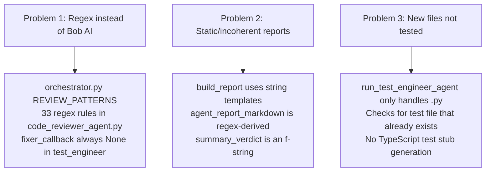

# Olha bob nesse respositorio onde o foco é de fazer um agente onde ele visa automatizar o processo de correção dos codigos está tendo os seguintes problemas:1. Eele está usando expressõe sregulares ao invés de chamar a IA do bob para resolver. Então no lugar do uso de expressões regulares PRECISO que você use da IA generativa bob para realizar esses testes2. Incoerencia do relatório com os resultaods. Preciso que os relatórios estejam prontos e batendo condizente com o teste e sem ser o conteudo estático3. A parte de testar o código não está funcionando quando inserimos novos arquivos. Portando a sua funçaõ um arquivo de plano.MD para executar essas tarefas visando resolver essa problmática.

---

**Status:** active  **Date:** 2026-08-30

---

### 👤 User

Olha bob nesse respositorio onde o foco é de fazer um agente onde ele visa automatizar o processo de correção dos codigos está tendo os seguintes problemas:1. Eele está usando expressõe sregulares ao invés de chamar a IA do bob para resolver. Então no lugar do uso de expressões regulares PRECISO que você use da IA generativa bob para realizar esses testes2. Incoerencia do relatório com os resultaods. Preciso que os relatórios estejam prontos e batendo condizente com o teste e sem ser o conteudo estático3. A parte de testar o código não está funcionando quando inserimos novos arquivos. Portando a sua funçaõ um arquivo de plano.MD para executar essas tarefas visando resolver essa problmática.

---

### 🤖 Assistant

> 🔧 called: use_skill

> 🔧 **use_skill** — create-plan

### 🤖 Assistant

> 🔧 called: spawn_subagent

Let me explore the codebase before asking clarifying questions.

> 🔧 **spawn_subagent** — explore

### 🤖 Assistant

> 🔧 called: read_file, read_file, read_file, read_file, read_file, read_file, read_file, read_file

Now I have a thorough understanding of the codebase. Let me read the key files directly to confirm specific details before designing the plan.

> 🔧 **read_file** — core/orchestrator.py

> 🔧 **read_file** — core/agents/code_reviewer_agent.py

> 🔧 **read_file** — core/orchestrator.py

> 🔧 **read_file** — core/agents/test_engineer_agent.py

> 🔧 **read_file** — core/orchestrator.py

> 🔧 **read_file** — core/runner/test_runner.py

> 🔧 **read_file** — .bob/agents/02-code-reviewer.md

> 🔧 **read_file** — .bob/agents/04-test-engineer.md

### 🤖 Assistant

> 🔧 called: read_file, read_file, read_file, read_file, read_file

Now let me also check the Bob agent persona files and the demo_server.py to fully understand the integration surface:

> 🔧 **read_file** — core/demo_server.py

> 🔧 **read_file** — .bob/agents/01-change-analyzer.md

> 🔧 **read_file** — .bob/agents/03-documentation-agent.md

> 🔧 **read_file** — .bob/agents/05-validation-agent.md

> 🔧 **read_file** — .bob/memory.md

### 🤖 Assistant

> 🔧 called: read_file, read_file

Now I have everything I need. Let me check the sample-app test structure as well to understand the new-files testing issue:

> 🔧 **read_file** — sample-app/jest.config.js

> 🔧 **read_file** — sample-app/tests/unit/payment.service.test.ts

### 🤖 Assistant

> 🔧 called: write_file

Now I have a complete picture of the codebase. I have enough grounding to write the plan. Let me now create it:

> 🔧 **write_file** — ai-integration-plan.md

### 🤖 Assistant

> 🔧 called: ask_followup_question

Here is my analysis and the plan I've written to [`ai-integration-plan.md`](ai-integration-plan.md).

---

## What I Found in the Codebase

The three problems you described map directly to specific code sections:

---

## The 5 Sub-Tasks in the Plan

| # | Sub-Task | Core Change |
|---|---|---|
| **1** | Bob AI Client Wrapper | Create `core/bob_client.py` — single integration point for all Bob calls |
| **2** | Replace Code Reviewer Regex | Wire `run_code_reviewer_agent()` to use Bob via `.bob/agents/02-code-reviewer.md` |
| **3** | Bob-Powered Self-Healing | Implement `bob_fixer_callback` in `test_engineer_agent.py` so the self-healing loop actually calls Bob to fix failing tests |
| **4** | New TypeScript File Test Generation | Detect new `.ts` files, call Bob to author Jest tests, write them before running the suite |
| **5** | Dynamic Report Generation | Ensure all `*_markdown` and `summary_verdict` fields contain real Bob output, not static templates |

---

## Key Decisions I Want You to Confirm

Before switching to implementation, please confirm:

1. **Bob's integration interface** — The `.bob/` agents are personas defined in Markdown. How should `bob_client.py` actually call Bob? Options:
   - Bob has an HTTP completion endpoint on a local port
   - We invoke Bob as a subprocess / MCP tool
   - We use the IBM watsonx.ai REST API with credentials in env vars

2. **Regex fallback** — Should the existing regex rules in `code_reviewer_agent.py` be kept as a fast pre-filter (safety net), or completely replaced by the Bob call?

3. **Scope of report changes** — The `latest-pipeline-run.json` schema must stay compatible with the React dashboard. Should the new `test_report_markdown` and richer `agent_report_markdown` fields be added, or only replace existing ones?

### 🤖 Assistant

How should `bob_client.py` call Bob's AI? The agent personas already exist in `.bob/agents/` but there's no current API call anywhere in the Python code.

> 🔧 **ask_followup_question** — How should `bob_client.py` call Bob's AI? The agent personas already exist in `.bob/agents/` but there's no current API call anywhere in the Python code.