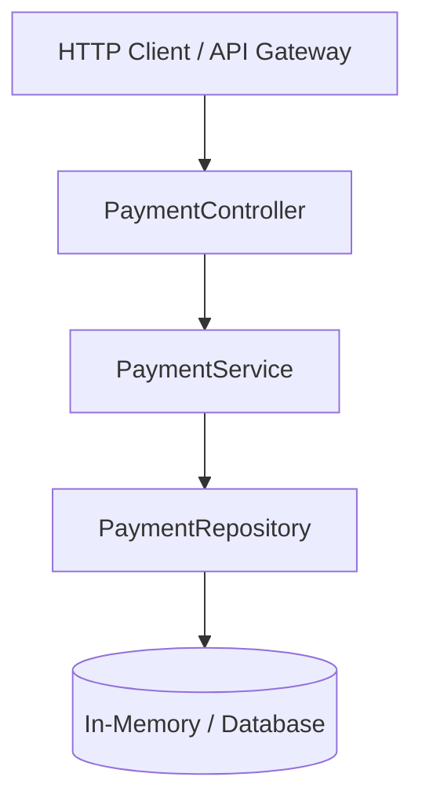
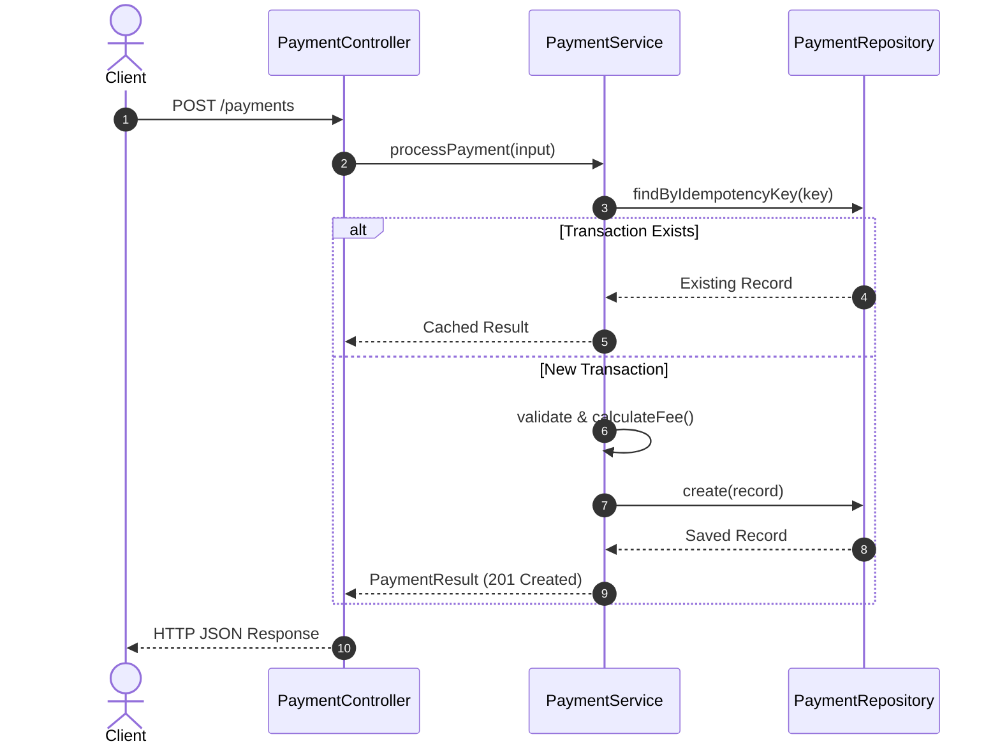

# Payment Service Architecture

## Architectural Layers

The application follows Clean Architecture principles with strict layering and unidirectional dependencies:

## Component Overview

1. **`PaymentController` (`src/controllers/payment.controller.ts`)**:
   - Validates incoming HTTP request formats, data types, and status code transformations.
   - Decouples HTTP concerns from business logic.

2. **`PaymentService` (`src/services/payment.service.ts`)**:
   - Executes domain rules, limits, fee calculations, and currency checks.
   - Enforces idempotent transaction execution.

3. **`PaymentRepository` (`src/repository/payment.repository.ts`)**:
   - Manages persistence layer and fast idempotency key indexing.

## Sequence Flow

## ChangeFlow Automated Documentation Sync

<!-- This section is automatically maintained by ChangeFlow -->
- `PIX` (_new identifier from sample-app/src/repository/payment.repository.ts, sample-app/src/services/payment.service.ts_)

